# ECT Token and Ecosystem

## Tokenomics Overview

```mermaid
graph TD
    A[ECT Token - Quasi-Stable Token] --> B[Token Utilities]
    A --> C[Value Stability]
    A --> D[Token Economics]

    B --> B1[Transaction Medium]
    B --> B2[Smart Contracts]
    B --> B3[HPC Access]
    B --> B4[Platform Deals]

    C --> C1[1 ECT ≈ 1 USD]
    C --> C2[Stability Mechanisms]

    D --> D1[Supply Management]
    D --> D2[Utility Backing]

    style A fill:#f9f,stroke:#333,stroke-width:4px
    style B fill:#bbf,stroke:#333
    style C fill:#bbf,stroke:#333
    style D fill:#bbf,stroke:#333

    classDef utility fill:#e1f5fe,stroke:#01579b
    class B1,B2,B3,B4 utility
```

## ECT Token Overview
The ECT token is (quazy stable token) an internal unit of account within our system, and its value is approximately equal to 1 dollar. This token plays a vital role in our ecosystem. It is used for conducting transactions among the participants of our network. It is also essential for the operation of smart contracts, making deals on our platform, and accessing high-performance cloud computing (HPC).

### Token Purchase
For purchasing ECT tokens, Solechange is used. The payment method for buying is the USDC stablecoin. Users send the USDC amount to the Solenopsys Foundation wallet, and the trading platform automatically conducts transactions for purchasing ECT at the minimum rate among all platform participants.

### Token Emission
The emission of ECT tokens occurs only when they are purchased on our trading platform SolExchange. It's important to note that the quantity of issued tokens is not limited. Emission of tokens is possible only if there are no other participants on the trading platform willing to sell tokens at a price lower than 1 USDC. In such a case, ECT tokens will be automatically issued at a price of 1 USDC per ECT.

### Token Burning
ECT tokens are only burned when executing the Hot Liquidity smart contract. This contract has strict usage restrictions and, upon execution, transfers USDC to an external wallet from the Solenopsys Foundation account.

### Hot Liquidity
The Hot Liquidity mechanism allows obtaining USDC tokens instead of ECT when executing a smart contract. This mechanism is designed to provide financial resources for community participants' projects and the rapid development of the Solenopsys infrastructure.

## Smart Contracts and Funds

### Smart Contracts Overview
Each smart contract has its own internal token, which functions as a share for that contract. Additionally, each smart contract can have its own logic. Smart contracts are used to facilitate complex transactions between participants. For example, they can be used to create micro-funds for specific projects or venture funds that finance multiple projects by purchasing their tokens. There are two types of smart contracts: regular ones that use the ECT token for settlements and "Hot Liquidity" smart contracts.

### Types of Funds
- Microfunds - a new concept of financing technological projects
- Funds - tokenized venture capital funds
- IPT tokens - like NFT tokens but for Intellectual Property Rights

## Growth Funds Structure

### Fund Formation
- Each fund has its own objective and strategy outlined in its description, along with an initial fund volume
- Fund sizes can vary from $10,000 to several million dollars, depending on available funds and goals
- Asset investments commence immediately upon fund availability, and the fund closes upon reaching its volume threshold
- Tokens can be traded on the marketplace immediately after the fund closes
- Dividends from fund assets are directed back into the fund and distributed to participants

### Token Distribution
- Tokens are burned until 100% of the expenses are reimbursed
- 80% of the fund's tokens are allocated among the current growth team
- The remaining 20% is allocated for financing Solenopsys Foundation operations

### Fund Management
- The fund may be sold entirely through participant voting
- Assets may be sold from the fund via participant-approved voting
- Changes to fund structure or operations require participant consensus through voting mechanisms

### Growth Team
The Growth Team consists of members of the Solenopsis community. For each fund, a new growth team is formed, made up of participants who have contributed to the growth of the Solenopsis ecosystem. This can include developers, influencers, project analysts, designers, and others. The shares of the participants depend on their contribution.

## Microfunds Deep Dive

### What are Microfunds?
Microfunds represent a new concept in financing technological projects. It involves breaking the project into separate microprojects, each of which creates a small, self-contained product with its own intellectual property. This approach is based on the use of smart contracts and open-source code.

### Advantages of Financing through Microfunds
1. Substantial reduction in the risk of capital loss
2. Preservation of value and control in the event of the parent project's bankruptcy
3. Minimal expenses when replacing the team
4. Justified assessment of value due to the use of open-source code
5. Simplification of the parent project's bankruptcy process

### How Microfunds Work
Let's assume you have an idea to create a new type of 3D printer based on your own technology. Here's how this process looks:

1. The project is broken down into individual components: motors, drivers, controllers, and various software modules
2. Components that already exist based on the Combinatorics and Converged frameworks are identified
3. Unique components are allocated to microfunds and brought to Matrix standards
4. Microfunds receive funding and commence development
5. The project is created using ready-made components from microfunds

### Traditional Corporations vs Microfunds

| Traditional Corporations | Microfunds |
|-------------------------|------------|
| Based on groups of people and internal framework | Based on intellectual property in open-source code |
| Large initial investments in commercial activities | Small investments directed to specific microfunds |
| Stage-based financing with high failure risk | 100% capital secured by smart contracts |
| Resources invested in organization structure | Independent, reusable product development |
| Value often lost in bankruptcy | Preserved value through standardized IP |
| Complex IP licensing process | Automated licensing through smart contracts |

## Foundation and Free Money Management

### Funds Distribution
Solenopsys Foundation is a nonprofit organization focused on ecosystem development. Funds are distributed to:
- Hot Liquidity
- Development account for platform developers
- Foundation operations, servers, and salaries

### Free Money Management
The Expansion.VC platform operates using the Stable Coin ECT for settlements. Approximately 20% of turnover remains in Expansion.VC accounts, presenting both opportunities and challenges:

Challenges:
- Cryptocurrency storage risks
- Potential for hacking attempts

Opportunities:
- Investment in various projects
- Increased system efficiency
- Reduced resource loss risks
- Simplified system operation

## IPT Tokens

### IPT Token Overview
IPT (Intellectual Property Token) is a blockchain-based token that represents property rights. It is a tool for managing two types of intellectual property rights:

- **Metapatent:** A tool for managing patent rights through blockchain, primarily for patents on inventions, methods, and devices.
- **Metaip:** A tool for managing rights to intellectual property, such as integrated circuit topologies, software products, and device architectures.

### MetaIP

MetaIP - Property Rights for Technical Developments on the Blockchain.

IP, or intellectual property, is a key concept in MetaIP, inspired by the term IPCores. IPCores are ready-made blocks
used in microchip design, essentially files sold as complete products. During microchip development, a manufacturer buys
several of these blocks with different functions, connects them, and creates a finished microchip with a specific set of
features.

MetaIP extends beyond microchip design to encompass any equipment with digital descriptions, such as equipment
blueprints or electronic board designs.

Developers create a device, save it as files, and register the usage rights on the blockchain through a smart contract.

Equipment manufacturers can then produce the device based on these blueprints and pay the developer royalties for using
the design via the smart contract. Similar to music rights or NFTs, MetaIP deals with specific developments rather than
just ideas, like patents do. It offers a new paradigm for realizing and monetizing technical creativity in the digital
age.

### MetaPatent

MetaPatent revolutionizes the patent licensing process by leveraging blockchain technology, simplifying and accelerating the licensing of patents.

Traditionally, patents registered in various countries require individual licensing agreements with each company, a process that is complex, time-consuming, and financially demanding.

The concept of MetaPatent introduces a virtual copy of a patent on the blockchain, linked to the actual patent registered across different countries. The smart contract within the blockchain specifies the licensing rules.

### Blockchain-Based Licensing
Blockchain technology facilitates the payment for license usage on a per-use basis, eliminating the need for individual licensing agreements. Patent holders can receive royalties without knowing who exactly is using the patent, similar to rights used in music licensing or NFTs. This method ensures a transparent, efficient, and secure way of managing patent licenses, opening new avenues for intellectual property utilization and monetization.
